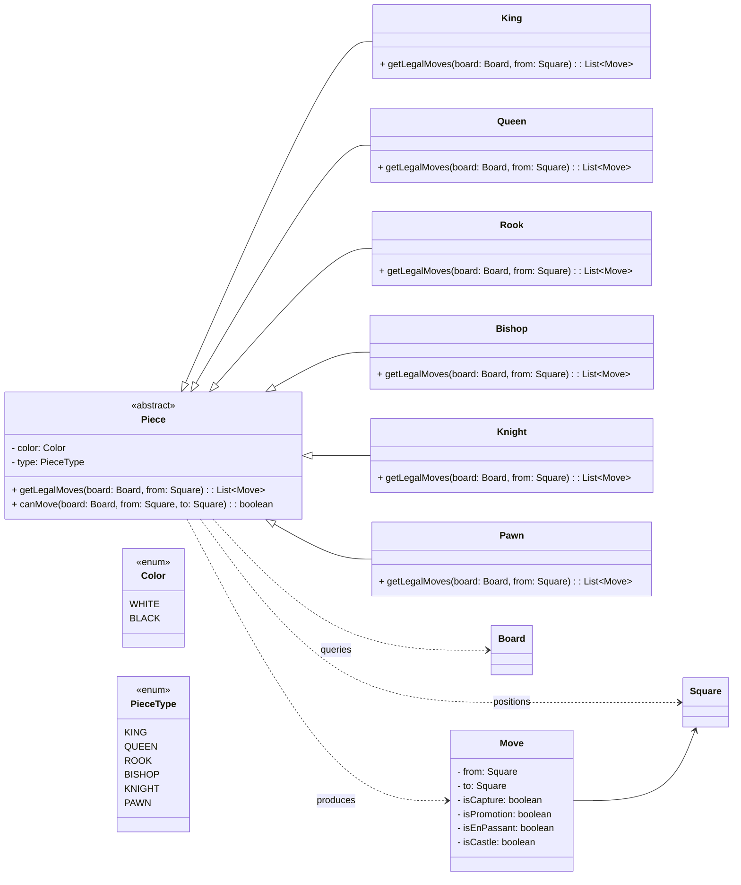

## Requirements

- **Board**: 8x8 chessboard
- **Players**: Two human players, turn-based
- **Rules**: Support all legal moves
## Core Entities

- **Piece**: Represents a chess piece (type, color); defines legal moves per type.
- **Player**: Controls one color and its pieces; takes turns.
- **Board**: 8x8 grid of squares; holds piece positions.
- **Game**: Orchestrates turns, validates moves, tracks check/checkmate/draw.

Optional: model `Square` (coordinate) and `Move` (from→to, flags) as value objects.

## Design Patterns

- **Strategy**: Encapsulate per-piece move logic behind a common interface.
- **Command**: Model a move as a command; enables undo/redo and move logging.
- **Memento**: Snapshot board/game state to support reliable undo/redo and analysis.
- **State**: Represent game states (in-progress, check, checkmate, stalemate) and allowed actions.
- **Observer**: Notify UI/clients/engines when board or game state changes.
- **Chain of Responsibility**: Pipeline of move validators (turn, piece rules, path block, check safety, special rules).
- **Factory / Abstract Factory**: Create pieces and initial setups (standard, variants, custom start positions).
- **Builder**: Build a board from inputs like FEN or test fixtures.
- **Prototype**: Clone board/game for hypothetical move simulation without mutating live state.
- **Flyweight**: Share intrinsic piece-type data (movement vectors, value) across instances to save memory.
- **Null Object**: Use an `EmptySquare`/`NoPiece` to avoid pervasive null checks on empty tiles.

## Piece Design

### Why this design

- **Strategy via polymorphism**: Each concrete piece implements its own `getLegalMoves`, keeping movement rules isolated and testable.
- **Single Responsibility**: `Piece` focuses on move generation; `Board` owns occupancy and bounds; `Game` validates king-safety and turn.
- **Extensibility**: New variants (e.g., `Amazon`, `Archbishop`) add new classes without touching existing ones.
- **Command-friendly**: Returning `Move` objects integrates with undo/redo and logging.
- **Testability**: Deterministic `getLegalMoves` enables targeted unit tests per piece and scenario.
